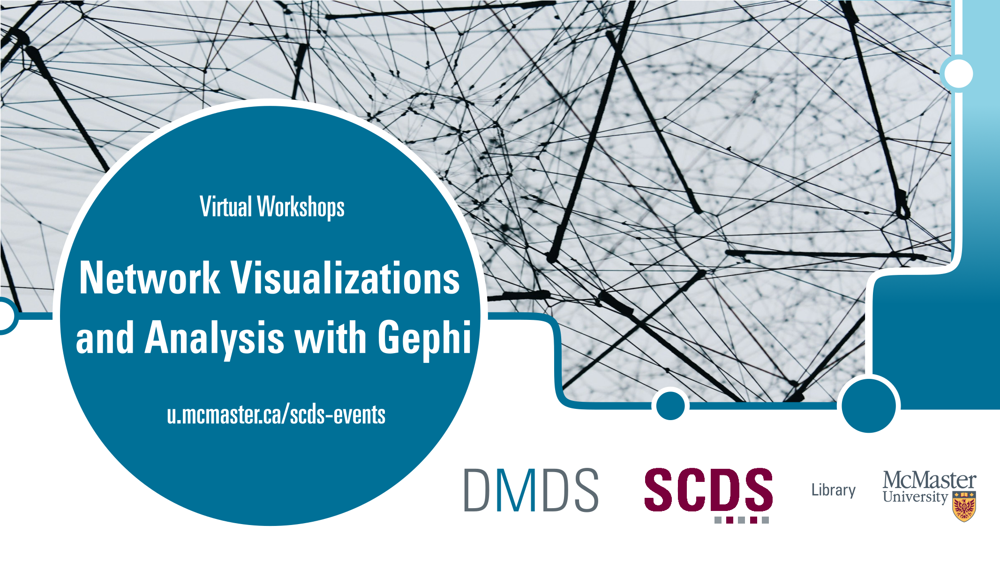

# Network Visualizations and Analysis with Gephi 

Learn to visualize and analyze networks in this introductory [Gephi](https://gephi.org/) workshop series. 

In the first part, which goes over network visualization, you will learn how graph data can help express relationships between entities and visualize networks for Humanities scholars.

In the second part, which goes over network analysis, we will take a look at how one can conduct network analysis for research, go through a case example, and discuss more features that researchers can use to design their own network visualizations. 

## Workshop Participation

Participants should download and install [Gephi](https://gephi.org/).

## Duration

Each workshop will take around 1 to 2 hours, however feel free to work at your own pace!

## Land Acknowledgment


